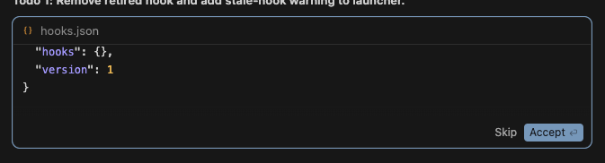

# 009 — Accept not clicked at session start

## Symptom

At the beginning of a new session, the auto-approve injector does not click
the "Accept ↩" button when Cursor shows a diff-accept dialog (e.g. for
`hooks.json` changes). The dialog has "Skip" + "Accept ↩" buttons — a classic
dismiss+approval pattern that should be eligible.

## Screenshot

The dialog shows:
- File: `hooks.json`
- Buttons: **Skip** (dismiss) + **Accept ↩** (approval with keyboard hint)
- Expected: auto-click on "Accept ↩"
- Actual: no click — prompt stays until manually resolved

## Likely Cause

At session start, the injector may not yet be loaded or the gate may not be ON
when the first approval prompt appears. Timing sequence:

1. Agent produces a change
2. Cursor shows the accept dialog immediately
3. The injector is either not yet injected (if this is a fresh launch) or the
   MutationObserver hasn't yet fired (if the dialog was present before the
   observer attached)

The 2s poll fallback should eventually catch it, but if the dialog appears in
the brief window between page load and injector injection, it will be missed
entirely.

## Status

**Open** — not yet fixed by the observer-policy rework. The rework improves
detection speed (MutationObserver fires within 300ms of DOM changes) but
doesn't address the cold-start timing gap where the dialog exists before
the injector is loaded.

## Potential Fixes

1. Run `checkAndClick()` immediately when `startAccept()` is called (not just
   on the next interval/observer tick) — catches prompts that were already
   present before the observer attached.
2. Reduce `CDP_INJECT_DELAY` to inject earlier.
3. Add a dedicated "catch-up scan" after observer setup that processes any
   existing prompt roots.
