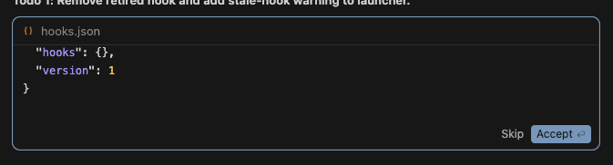

# 009 — Accept not clicked at session start

## Symptom

At the beginning of a new session, the auto-approve injector does not click
the "Accept ↩" button when Cursor shows a diff-accept dialog (e.g. for
`hooks.json` changes). The dialog has "Skip" + "Accept ↩" buttons — a classic
dismiss+approval pattern that should be eligible.

## Screenshot

The dialog shows:
- File: `hooks.json`
- Buttons: **Skip** (dismiss) + **Accept ↩** (approval with keyboard hint)
- Expected: auto-click on "Accept ↩"
- Actual: no click — prompt stays until manually resolved

## Historical Cause

At session start, the injector may not yet be loaded or the gate may not be ON
when the first approval prompt appears. Timing sequence:

1. Agent produces a change
2. Cursor shows the accept dialog immediately
3. The dialog is already present when the MutationObserver attaches, so no new
   mutation necessarily triggers a scan.

## Status

**Resolved in the current implementation.** `start()` now installs the observer
and schedules `checkAndClick()` after 50 ms, providing a catch-up scan for
prompts that already existed when the observer attached. The fallback poll now
defaults to 0.5 seconds.

The sanitized real-prompt replay fixture
`tests/fixtures/real-prompts/skip-accept-diff-dialog.json` preserves the
`Skip` + `Accept ↩` label and single-click policy coverage.

Live validation is still required after Cursor upgrades because the fixture
proves matching policy, while the 50 ms startup scan is what closes the timing
gap.
